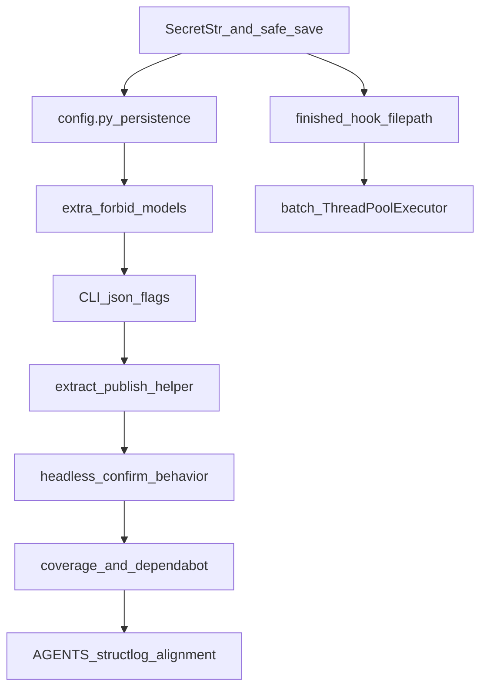

# Implement May 4, 2026 code review recommendations

Source: [May 4, 2026: jre-vidget Code Review Report](https://www.notion.so/abstractdata/May-4-2026-jre-vidget-Code-Review-Report-3567d7f56298816480d3d7f141b6e39f) (Notion).

## Preconditions (repo rules)

- Before editing symbols, run GitNexus **impact** upstream for each touched public symbol (e.g. `AuthConfig`, `get_credentials`, `download`, `download_batch`, `AppConfig.load` / `save`, CLI commands). Warn if any result is HIGH/CRITICAL.
- After implementation, run `uv run pytest`, `uv run ruff check src/`, `uv run ty check src/ tests/`, and GitNexus **detect_changes** before commit.
- Re-run `npx gitnexus analyze` after merge if the graph is used for follow-up work.

## Workstream A — Security and config integrity (Priority 1)

### A1. P1-SEC-001: `SecretStr` for sensitive auth fields

- Update [`src/jre_vidget/models.py`](src/jre_vidget/models.py) `AuthConfig`: use `SecretStr | None` for `client_secret` and `refresh_token` (keep `client_id` as plain `str | None` unless you choose parity for masking).
- **Critical implementation detail:** Pydantic’s default JSON serialization masks secrets. Plaintext `~/.vidget/config.json` must remain loadable. Implement explicit persistence:
  - Either a **custom `AppConfig` serializer** for `save()` that writes real secret strings to disk only in that path, or build the JSON payload with `get_secret_value()` for those fields after `model_dump(mode="python")`.
  - Ensure `model_validate_json` on load still accepts existing plain strings in user files (normal `SecretStr` coercion from str).
- Touch call sites to unwrap secrets only where raw strings are required:
  - [`src/jre_vidget/auth.py`](src/jre_vidget/auth.py) `get_credentials` / `login_browser` (lines ~52–83 area): use `.get_secret_value()` when comparing or passing to Google libraries.
  - [`src/jre_vidget/cli.py`](src/jre_vidget/cli.py) `auth_login`: `typer.prompt` fallback when `cfg.auth.client_secret` is unset must treat `SecretStr` correctly; avoid leaking secrets in Rich panels (audit [`src/jre_vidget/ui.py`](src/jre_vidget/ui.py) `print_config` row for secrets — print placeholder, not values).
- Extend tests in [`tests/unit/test_youtube_models.py`](tests/unit/test_youtube_models.py), [`tests/unit/test_auth.py`](tests/unit/test_auth.py), and any CLI tests that assert on auth fields.

### A2. P1-SEC-002: `extra="forbid"` on externally loaded models

- Add `model_config = ConfigDict(extra="forbid", arbitrary_types_allowed=True)` (or equivalent) to [`AppConfig`](src/jre_vidget/models.py), [`DownloadConfig`](src/jre_vidget/models.py), and other models loaded from JSON / user files where silent drops are risky.
- **Decision:** Prefer `forbid` for strictness; if you need forward-compatible unknown keys from newer app versions, document a deliberate `extra="ignore"` only on `AppConfig` and keep `forbid` on `DownloadConfig`.

### A3. P1-ARCH-001: Resolve [`src/jre_vidget/config.py`](src/jre_vidget/config.py) stub

- Implement real persistence in `config.py`: `CONFIG_PATH`, `load_app_config()`, `save_app_config(cfg: AppConfig)` (import `AppConfig` from `models` — **no** `models` → `config` top-level import to avoid cycles).
- Remove inline `CONFIG_PATH` and file I/O from [`models.py`](src/jre_vidget/models.py); keep `AppConfig` as the data shape. Thin wrappers on `AppConfig`: `load()` / `save()` delegate into `jre_vidget.config` via **lazy import inside methods** to avoid import cycles, or migrate all call sites to `config.load_app_config()` (larger diff).
- Update tests that currently monkeypatch `jre_vidget.models.CONFIG_PATH` to patch [`jre_vidget.config.CONFIG_PATH`](src/jre_vidget/config.py) (and adjust [`GUARDRAILS.md`](GUARDRAILS.md) / [`TESTING.md`](TESTING.md) one-liners only if you touch those files as part of aligning docs—otherwise skip per “no drive-by doc” unless you need accuracy for the team).

## Workstream B — Engine correctness and performance

### B1. P2-PERF-001: Capture output path from yt-dlp `finished` hook

- [`ProgressData`](src/jre_vidget/engine.py) already includes `filename`.
- In [`download()`](src/jre_vidget/engine.py), wrap the user `progress_hook` passed into [`build_ydl_opts`](src/jre_vidget/engine.py): on `status == "finished"` and `filename` is a `str`, store it in a closure/list cell; use that as `DownloadResult.filepath` when present.
- Keep [`_find_newest_output_file`](src/jre_vidget/engine.py) as **fallback** when the hook did not yield a filename (defensive), or remove if fully redundant after tests prove hook coverage.
- Add unit test(s) mocking yt-dlp path that assert filepath is set without relying on directory mtime scan.

### B2. P1-FEAT-001: Honor `max_concurrent` in [`download_batch`](src/jre_vidget/engine.py)

- Use `concurrent.futures.ThreadPoolExecutor(max_workers=job.config.max_concurrent)` (or `min(len(urls), ...)`) to run per-URL `download()` calls.
- **Thread safety:** [`ui.make_progress_hook`](src/jre_vidget/ui.py) + Rich `Progress` are not designed for concurrent callbacks. Serialize hook/on_result invocations with a `threading.Lock`, or document that concurrent batch uses a simplified/no-bar hook (least surprise: prefer a lock around shared UI callbacks).
- Preserve “never raises” contract: retain per-URL try/except into `DownloadResult`.

### B3. P3 magic numbers

- Extract `RETRY_BACKOFF_SECONDS` and (if fallback remains) `FILE_DISCOVERY_WINDOW_SECONDS` as module-level constants in [`engine.py`](src/jre_vidget/engine.py).
- OAuth callback port in [`auth.py`](src/jre_vidget/auth.py): named constant or optional parameter on `login_browser` surfaced through CLI later (constant minimum).

## Workstream C — CLI agent contract and maintainability

### C1. P2-FEAT-001: `--json` on `download`, `batch`, `formats`

- Mirror [`preview`](src/jre_vidget/cli.py) pattern: `json_output: bool = typer.Option(False, "--json", ...)`.
- When `--json`: stdout = **only** `model_dump_json` / `json.dumps` for structured payloads (`DownloadResult`, batch summary or list of results, `VideoInfo` for formats); stderr for any diagnostics; skip Rich tables (per [AGENTS.md](AGENTS.md) contract).
- Add/adjust CLI unit tests (Typer `CliRunner`) for each command.

### C2. P2-MAINT-001: Shorten [`download`](src/jre_vidget/cli.py)

- Extract a private helper e.g. `_publish_after_download(...)` taking `cfg`, `result`, `PublishConfig` pieces, and `video_info` / title resolution—keeps Typer command under ~80 lines without changing behavior.

### C3. P3-FEAT-001: Headless / TTY behavior

- Implement `_is_headless()` (`not sys.stdin.isatty()`) in [`cli.py`](src/jre_vidget/cli.py) (or tiny `cli_support.py` if you want to avoid growing `cli.py`).
- Apply to [`config_reset`](src/jre_vidget/cli.py) and the publish confirmation (`typer.confirm` ~L480): in non-TTY, either require `--yes` or exit with code 2 and a clear message—match the pattern already described in [AGENTS.md](AGENTS.md).

## Workstream D — Observability, CI, dependencies

### D1. P1-OBS-001: Align docs vs code

- **Lower-cost path (recommended for this repo):** Update [AGENTS.md](AGENTS.md) (and any duplicate in [CLAUDE.md](CLAUDE.md) if it repeats the structlog claim) to state **stdlib `logging`** is the current standard unless/until structlog is adopted.
- **Alternative:** Add `structlog` dependency and wire minimal config in `engine`/`auth`—more moving parts; only choose if you want structured logs in Actions.

### D2. P2-TEST-001: Coverage threshold in CI

- In [`.github/workflows/ci-tests.yml`](.github/workflows/ci-tests.yml), add e.g. `--cov-fail-under=70` (pick a baseline from current `coverage.json` once generated locally so the first PR does not flip CI red arbitrarily).

### D3. P3-SEC-001: Dependabot

- Add [`.github/dependabot.yml`](.github/dependabot.yml) for `uv`/`pip` (and optionally GitHub Actions). No runtime code impact.

### D4. P2-SEC-001: Dependency version ceilings

- **Trade-off:** Upper bounds reduce surprise breaks; they also block security patches until range bumps. Document a policy in the PR; optionally add conservative upper bounds only for `yt-dlp` first. **Confirm with maintainer** if policy conflicts with “ask before dependency changes”—treating pin strategy as part of this approved bundle is reasonable.

## Suggested implementation order

1. **A1 + A3** together (persistence logic centralized helps Secret serialization).
2. **A2** (may surface bad keys in tests—fix fixtures).
3. **B1** (reduces reliance on 60s scan).
4. **C1 + C2** (agent contract + readability).
5. **B2** (highest concurrency risk—after hook/JSON paths stable).
6. **C3**, **B3**, **D2**, **D3**, **D1**, **D4** (can parallelize some with care).

## Validation

- `uv run pytest tests/`
- `uv run ruff check src/ tests/` and `uv run ruff format src/`
- `uv run ty check src/ tests/`
- Spot-check: `uv run vidget download --help` / `batch` / `formats` show `--json`; `vidget download <url> --json` stdout parses as JSON.
- Manual: concurrent batch with `max_concurrent=2` and Rich progress does not crash.

## Out of scope / explicit deferrals (unless you want them in the same PR)

- Full **structlog** adoption (D1 alternative)—large surface; docs-first is enough to close the review contradiction.
- **Circuit breaker** for YouTube API (mentioned narratively, not in prioritized ID list)—defer.
- Rewriting **AGENTS.md** phase table or adding new phases—unnecessary for these fixes.
