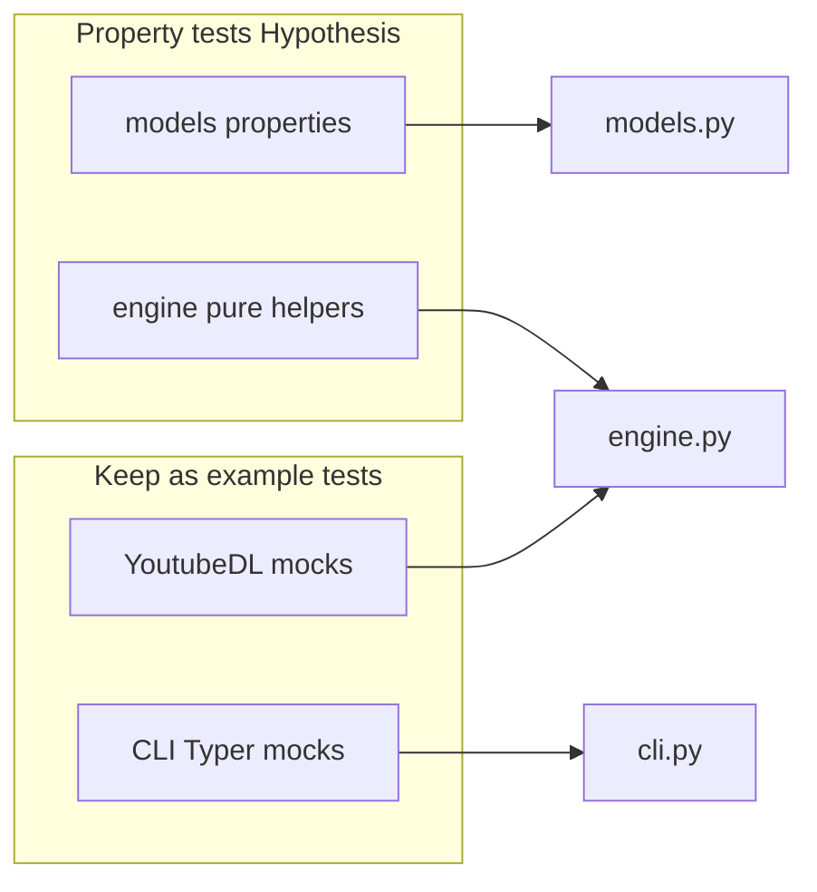

# Hypothesis adoption (selective property-based tests)

## Recommendation: yes, but scoped

**Use Hypothesis** for a small, fast layer of property tests on **pure, deterministic** code in [`src/jre_vidget/models.py`](src/jre_vidget/models.py) and **deterministic helpers** in [`src/jre_vidget/engine.py`](src/jre_vidget/engine.py) (e.g. [`build_ydl_opts`](src/jre_vidget/engine.py), `_ydl_format_for_config`, `_merge_output_format`). That matches **correctness** over speculative coverage: generated inputs find formatting and counting bugs humans rarely hand-pick.

**Do not** try to replace mock-heavy tests in [`tests/test_engine.py`](tests/test_engine.py), [`tests/test_cli.py`](tests/test_cli.py), or [`tests/unit/test_preview.py`](tests/unit/test_preview.py) with Hypothesis first—those tests assert orchestration and I/O boundaries; PBT there adds complexity and flakiness risk without clear payoff.

The repo already ignores [`.hypothesis/`](.gitignore) for cache; no structural change needed beyond dependency + new test module(s).

## Concrete property targets (first slice)

| Area | Property / invariant | Notes |
|------|---------------------|--------|
| `Quality` | `ydl_format` non-empty; for `AUDIO`, string matches audio preset | Small `st.sampled_from(Quality)` |
| `OutputFormat` | `is_audio_only` iff format in audio set | Exhaustive or sampled |
| `VideoPreview.duration_display` | For `duration_seconds >= 0`, output matches `H:MM:SS` or `M:SS` pattern; components reconstruct seconds | Use `st.integers(min_value=0, max_value=...)` to keep CI fast |
| `VideoInfo.duration_str` | Same style for optional duration (skip or fix strategy when `None` → `"unknown"`) | |
| `VideoFormat.display_size` | `filesize is None` → `"unknown"`; else string ends with `" MB"` and parses | Bounded `filesize` |
| `AuthConfig` | `model_validate_json(model_dump_json())` identity for generated optional strings | Avoid unbounded text; use `st.text(max_size=...)` or `st.none() \| st.text(...)` |
| `BatchJob` | For arbitrary `results` list, `completed + failed <= len(results)` and counts match status filters | Build `DownloadResult` with sampled `DownloadStatus` |
| `build_ydl_opts` | For all `(Quality, OutputFormat)` pairs (finite grid), assert stable keys (`format`, `merge_output_format`, postprocessors) and audio vs video branches | `@pytest.mark.parametrize` could cover this; Hypothesis `st.tuples(st.sampled_from(...), st.sampled_from(...))` is equivalent—pick one style; grid is ~42 pairs, trivial runtime |

## Dependency and CI

- Add `hypothesis` to `[project.optional-dependencies]` **dev** in [`pyproject.toml`](pyproject.toml) (pin lower bound, e.g. `hypothesis>=6`, consistent with `pytest>=8`).
- CI already runs [`uv sync --frozen --all-extras`](.github/workflows/ci-tests.yml), which will install **dev** once Hypothesis is listed there—no workflow edit required unless dev is not part of `all-extras` in your lockfile; verify after `uv lock` that the lock includes hypothesis for the matrices you care about.

## Settings (speed / determinism)

- Prefer **explicit** `@settings(max_examples=..., deadline=None)` on slower properties or those building Pydantic models, to honor [TESTING.md](TESTING.md) unit suite **&lt; 5s** target.
- Optional: [`tests/conftest.py`](tests/conftest.py) `pytest_configure` hook to register a `hypothesis` profile for CI (e.g. `derandomize=True`, lower `max_examples`) vs local—only if default runs prove noisy or slow; start minimal.

## Documentation (light touch)

- Append a short **Property-based tests** subsection to [TESTING.md](TESTING.md): when to use Hypothesis vs examples, how to run (`uv run pytest tests/unit/test_properties_*.py`), and link to [Hypothesis docs](https://hypothesis.readthedocs.io/).

## Governance before implementation (after you approve)

- Per [CLAUDE.md](CLAUDE.md) / GitNexus rules: if implementation **only** adds tests and `pyproject.toml`/`uv.lock`, impact on `src/` symbols may be none. If Hypothesis finds a bug and you **change** [`models.py`](src/jre_vidget/models.py) or [`engine.py`](src/jre_vidget/engine.py), run **`gitnexus_impact`** on the edited symbol(s) upstream before merging, and **`gitnexus_detect_changes`** before commit.
- After substantive `src/` edits, re-run `npx gitnexus analyze` when appropriate (per project docs).

## Out of scope (unless you explicitly want later)

- `hypothesis-jsonschema` / third-party Pydantic strategies for full arbitrary model generation.
- Stateful / rule-based tests for download retries.
- Rewriting existing integration tests to PBT.

---

## Annotated tasks (Plan Mode protocol)

**TASK-1** — Add `hypothesis` to dev deps and refresh lockfile  
Exec mode: sequential  
Model: claude-sonnet-4-6 (or cursor-auto)  
Model rationale: straightforward manifest and lockfile edit.  
Est. tokens: &lt;10K  

**TASK-2** — New `tests/unit/test_properties_models.py` (or split `test_properties_engine.py` if engine tests grow)  
Exec mode: sequential[after: TASK-1]  
Model: claude-sonnet-4-6  
Model rationale: needs careful invariant design and Hypothesis API familiarity.  
Est. tokens: ~50K  

**TASK-3** — Update [TESTING.md](TESTING.md) with Hypothesis subsection  
Exec mode: sequential[after: TASK-2]  
Model: claude-haiku-4-5  
Model rationale: short doc addition.  
Est. tokens: &lt;10K  

**TASK-4** — `uv run pytest`, `uv run ruff check`, confirm CI budget  
Exec mode: sequential[after: TASK-2]  
Model: cursor-auto  
Model rationale: validation only.  
Est. tokens: &lt;10K  

If any TASK-2 property fails, treat as a **correctness** finding: fix production code only with GitNexus impact on the touched symbol.
