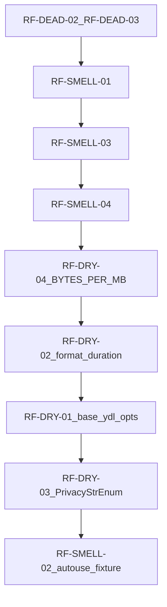

# Implement Notion refactoring analysis (May 4, 2026)

## Source of truth

- Notion: [May 4, 2026: jre-vidget Refactoring Analysis Report](https://www.notion.so/3567d7f56298812fb3a6e88952e2aa50) — 14 issues across DRY, smells, dead code, one long-parameter note, one publisher typing note.
- Local tracker [.cursor/plans/code_review_fixes_045068d6.plan.md](.cursor/plans/code_review_fixes_045068d6.plan.md) describes a **different** workstream (security / agent CLI); much of that is already present in `src/` (e.g. `SecretStr`, `extra="forbid"`, `ThreadPoolExecutor`, `--json`, `_is_headless`, `_publish_after_download`, `cov-fail-under`, [`.github/dependabot.yml`](.github/dependabot.yml)).

## Reconcile stale finding: RF-DEAD-01

The report assumes [`src/jre_vidget/config.py`](src/jre_vidget/config.py) is an unused stub. **Today it is not:** it owns `CONFIG_PATH`, `load_app_config` / `save_app_config`, and plaintext secret serialization for `~/.vidget/config.json`. **Do not delete it.** Treat RF-DEAD-01 as **superseded** by the code-review persistence design ([`AppConfig.load` / `save`](src/jre_vidget/models.py) delegating to `jre_vidget.config`).

## Gap analysis vs current repo

| ID | Item | Status |
|----|------|--------|
| RF-DRY-01 | Shared yt-dlp base opts | **Open** — still three separate dicts with `quiet` / `no_warnings` / `noplaylist` in [`engine.py`](src/jre_vidget/engine.py) (~L107–113, ~228–231, ~287–290). |
| RF-DRY-02 | Shared duration formatting | **Open** — [`VideoPreview.duration_display`](src/jre_vidget/models.py) vs [`VideoInfo.duration_str`](src/jre_vidget/models.py) still duplicate logic. |
| RF-DRY-03 | Privacy values single source | **Open** — [`cli.py`](src/jre_vidget/cli.py) `PrivacyStatus` + `_VALID_PRIVACY` vs [`PublishConfig.privacy`](src/jre_vidget/models.py) `Literal[...]`. |
| RF-DRY-04 | `BYTES_PER_MB` constant | **Open** — `1_048_576` still inline in [`models.py`](src/jre_vidget/models.py) (`display_size`) and [`ui.py`](src/jre_vidget/ui.py) (`_format_size_cell`). |
| RF-SMELL-01 | `assert` in progress hook | **Open** — [`ui.py` ~L259](src/jre_vidget/ui.py) `assert tid is not None` after `add_task`. |
| RF-DEAD-01 | Delete `config.py` | **Obsolete** — keep module; optionally add a one-line module docstring clarifying it is the persistence layer (if you want doc clarity only). |
| RF-DEAD-02 | Remove placeholder test | **Open** — [`tests/test_placeholder.py`](tests/test_placeholder.py) still exists. |
| RF-DEAD-03 | Remove `main()` from package | **Open** — [`src/jre_vidget/__init__.py`](src/jre_vidget/__init__.py) still defines `main()`. Confirm nothing in docs or tooling invokes `jre_vidget.main` before removal (quick grep). |
| RF-SMELL-02 | Deduplicate config path monkeypatch | **Partially addressed** — tests patch `jre_vidget.config` as `vidget_config` ([`test_youtube_cli.py`](tests/integration/test_youtube_cli.py)); many methods still repeat the same two lines. Add module-scoped `autouse` fixture (patch `vidget_config.CONFIG_PATH`) to collapse repetition. |
| RF-SMELL-03 | `token_uri` constant | **Open** — duplicated string in [`auth.py`](src/jre_vidget/auth.py) L50 and L90. |
| RF-MAGIC-01 | Name magic numbers in engine | **Done** — [`RETRY_BACKOFF_SECONDS`](src/jre_vidget/engine.py), [`FILE_DISCOVERY_WINDOW_SECONDS`](src/jre_vidget/engine.py). |
| RF-SMELL-04 | Replace `cast()` on upload chunk | **Open** — [`publisher.py` ~L84](src/jre_vidget/publisher.py) `cast(dict[str, Any] | None, chunk)`. |
| RF-PARAM-01 | Split `download` publish flags | **Deferred by default** — new subcommand or reshaped CLI is a **user-visible contract change**; per your incremental rule, **describe and wait for approval** before implementing. |

## Major refactor?

**No single large refactor is required** to satisfy the Notion doc: work is incremental DRY, constants, dead-code removal, test fixture, and one type-safety guard.

The only item that **would** be a structural / product change is **RF-PARAM-01** (splitting `download --publish` into a dedicated flow). That is optional and should only ship after explicit go-ahead.

## Implementation order (efficient dependency order)

1. **Dead code (RF-DEAD-02, RF-DEAD-03)** — Delete placeholder test; remove unused `main()` from `__init__.py` after confirming no entry points or docs rely on it.
2. **RF-SMELL-01** — Replace `assert tid is not None` with `if tid is None: return` (or equivalent) in `make_progress_hook`.
3. **RF-SMELL-03** — Module constant `_GOOGLE_TOKEN_URI` in `auth.py`; use in `client_config` and `Credentials(...)`.
4. **RF-SMELL-04** — After `next_chunk()`, `if not isinstance(chunk, dict): raise PublishError(...)`; then assign `response = chunk` without `cast`.
5. **RF-DRY-04** — Define `BYTES_PER_MB = 1_048_576` in `models.py` (or small `constants.py` if you prefer zero coupling — not required); import constant in `ui.py` for `_format_size_cell` only (keep formatting strings as today: precise vs `~` table).
6. **RF-DRY-02** — Add `_format_duration(seconds: int) -> str` in `models.py`; handle `VideoInfo.duration` `None` in the property before calling helper. Reuse for `VideoPreview.duration_display`.
7. **RF-DRY-01** — Add `_base_ydl_opts() -> dict[str, Any]` in `engine.py` returning shared keys; merge/spread in `build_ydl_opts`, `fetch_info`, `preview` with each site’s extra keys (`format`/`outtmpl`, `extract_flat`, `skip_download`, hooks, etc.).
8. **RF-DRY-03** — Add `PrivacyStatus(StrEnum)` in `models.py`; set `PublishConfig.privacy: PrivacyStatus = PrivacyStatus.PUBLIC`; update `cli._parse_privacy` to validate via enum; remove duplicate `Literal` / frozenset where redundant; adjust tests and any JSON serialization (enum values serialize to their string values).
9. **RF-SMELL-02** — In [`tests/integration/test_youtube_cli.py`](tests/integration/test_youtube_cli.py), add `@pytest.fixture(autouse=True)` that patches `vidget_config.CONFIG_PATH` to `tmp_path / "config.json"` and remove per-test duplication (keep exceptions only if a test needs a different path).

## GitNexus and validation (repo rules)

Before editing each public symbol (`build_ydl_opts`, `fetch_info`, `preview`, model properties, `login_browser`, `get_credentials`, `upload`, CLI helpers), run **upstream impact** for that symbol; if any result is HIGH/CRITICAL, surface it before merging.

After implementation:

- `uv run pytest`
- `uv run ruff check src/ tests/` and `uv run ruff format src/ tests/`
- `uv run ty check src/ tests/`
- GitNexus **detect_changes** on staged files before commit

## Optional / out of scope unless you ask

- **RF-PARAM-01** — Subcommand or flag-group redesign; needs product approval.
- **Tooling table in Notion** (SIM, vulture, radon, pylint) — policy decision; not required to close the 14 functional items.

## Notion doc hygiene (optional)

Consider adding a short note on the Notion page that RF-DEAD-01 was superseded when `config.py` became the persistence module, so future readers do not delete it by mistake.
