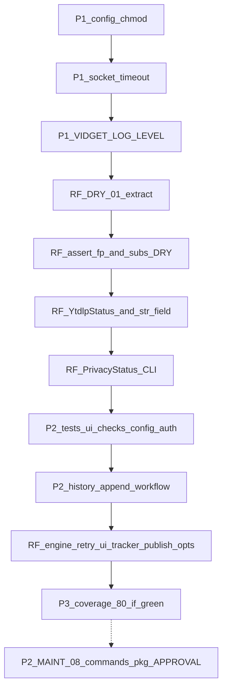

# Fix everything from the two May 4, 2026 Notion reports

**Sources (authoritative):** [Code Review Report](https://www.notion.so/3567d7f5629881d6a2e8f0962ce3a0b2), [Refactoring Analysis Report](https://www.notion.so/3567d7f56298819ebf76d0d98d572c83).

**Stale local trackers:** [.cursor/plans/code_review_fixes_045068d6.plan.md](.cursor/plans/code_review_fixes_045068d6.plan.md) and [.cursor/plans/notion_refactoring_rollout_e9768737.plan.md](.cursor/plans/notion_refactoring_rollout_e9768737.plan.md) use older ID meanings (e.g. RF-DEAD-01 as “delete config.py”). The **Notion** refactoring doc is the checklist to follow; several of its items are **not** implemented in `main` today.

---

## Already satisfied (verify only; no code unless drift)

| Report claim | Repo evidence |
|--------------|---------------|
| **P2-SEC-004** Dependabot for Python | [`.github/dependabot.yml`](.github/dependabot.yml) already has `package-ecosystem: pip` |
| **RF-DRY-04 / BYTES_PER_MB** | [`src/jre_vidget/models.py`](src/jre_vidget/models.py) defines `BYTES_PER_MB`; [`src/jre_vidget/ui.py`](src/jre_vidget/ui.py) imports it |
| **RF-SMELL-03** (token URI) | [`src/jre_vidget/auth.py`](src/jre_vidget/auth.py) uses `_GOOGLE_TOKEN_URI` |
| **Publisher `cast`** | No `cast(` in [`src/jre_vidget/publisher.py`](src/jre_vidget/publisher.py) (already cleaned) |
| **Placeholder test / `__init__.main`** | No `test_placeholder.py`; [`src/jre_vidget/__init__.py`](src/jre_vidget/__init__.py) is version-only |

---

## Phase 1 — Code review P1 (security + correctness)

Per conflict hierarchy: **security and correctness** before performance/style.

### P1-SEC-001 — Config file permissions ([`src/jre_vidget/config.py`](src/jre_vidget/config.py))

- After `write_text` in `save_app_config`, call `CONFIG_PATH.chmod(0o600)`.
- Optionally `CONFIG_PATH.parent.chmod(0o700)` when the directory is first created (guard: only chmod if we created it or document one-time hardening — simplest approach matches Notion: set after `mkdir`).
- Add a small unit test (temp `CONFIG_PATH`) asserting mode bits on Unix.

### P1-SEC-002 — yt-dlp socket timeout ([`src/jre_vidget/engine.py`](src/jre_vidget/engine.py))

- Add module constant e.g. `YDL_SOCKET_TIMEOUT_SECONDS = 30` and include `"socket_timeout": YDL_SOCKET_TIMEOUT_SECONDS` in [`_base_ydl_opts()`](src/jre_vidget/engine.py) so **all** call sites (`fetch_info`, `preview`, `build_ydl_opts` / download path) inherit it.
- Unit-test by asserting merged opts contain `socket_timeout` (mock-free) or by patching `YoutubeDL` if needed.

### P1-OPS-003 — `VIDGET_LOG_LEVEL` ([`src/jre_vidget/cli.py`](src/jre_vidget/cli.py), [`.env.example`](.env.example))

- In `@app.callback()` `main()`, before `check_dependencies`: read `os.getenv("VIDGET_LOG_LEVEL", "WARNING")`, normalize with `getattr(logging, name, logging.WARNING)`, call `logging.basicConfig(level=...)` once (Typer may invoke callback per subcommand — use a module-level `_logging_configured` flag if duplicate `basicConfig` is a concern).
- Align `.env.example` comment with real behavior.

**GitNexus:** run upstream **impact** before editing `save_app_config`, `_base_ydl_opts`, and `main` (symbols: `save_app_config`, `_base_ydl_opts`, `main`).

---

## Phase 2 — Refactoring report: critical + high (engine + CLI behavior)

### RF-DRY-01 — Shared `_extract_raw_info` ([`src/jre_vidget/engine.py`](src/jre_vidget/engine.py))

- Introduce internal helper (e.g. `_ExtractionError` + `_extract_raw_info(url, extra_opts)`) exactly as the Notion sketch: one `extract_info` try/except/type-check; [`fetch_info`](src/jre_vidget/engine.py) maps errors → `EngineError`; [`preview`](src/jre_vidget/engine.py) → `DownloadError`.
- Keeps exception types and messages stable for existing tests.

### RF-SMELL-02 — Replace `assert` in [`_publish_after_download`](src/jre_vidget/cli.py) (~L166)

- If `result.filepath is None`, raise a clear `EngineError` (or `typer.Exit(1)` with message) — never rely on `-O` stripping asserts.

### RF-DRY-02 + RF-SMELL-04 — `_resolve_download_config` + **subs tri-state bug**

- Notion: `download` / `batch` use `subs: bool = typer.Option(False, ...)`, so **`--no-subs` cannot override `cfg.subtitles=True`**.
- Change **`download` and `batch`** to `subs: bool | None = typer.Option(None, "--subs/--no-subs", ...)` (same pattern as any existing command at ~L435 in [`cli.py`](src/jre_vidget/cli.py)).
- Extract `_resolve_download_config(cfg, quality, out_format, output, subs) -> DownloadConfig` to remove duplicated resolution blocks.

### RF-SMELL-01 — `YtdlpStatus` StrEnum ([`src/jre_vidget/models.py`](src/jre_vidget/models.py) or small `constants.py`)

- Define enum values `downloading`, `finished`, `error`; use in [`engine.py`](src/jre_vidget/engine.py) finished-hook check and [`ui.py`](src/jre_vidget/ui.py) `make_progress_hook` branches.
- `ProgressData` can stay `str`-typed for yt-dlp compatibility, but compare using `.value` or normalize at boundary.

### RF-DRY-03 — `_str_field(raw, key, default="")` ([`src/jre_vidget/engine.py`](src/jre_vidget/engine.py))

- Deduplicate repeated `raw.get("x")` + `isinstance(..., str)` patterns in `_raw_to_video_info` and `preview` (and any other local extractions).

### RF-SMELL-03 — `PrivacyStatus` at CLI boundaries

- [`PrivacyStatus`](src/jre_vidget/models.py) already exists; wire Typer options on `download` / `publish` to `PrivacyStatus` where feasible, and change [`_dispatch_publish_workflow`](src/jre_vidget/cli.py) / [`_publish_after_download`](src/jre_vidget/cli.py) to accept `PrivacyStatus` (serialize to `str` only at `gh workflow` / API edge).
- Remove redundant `_parse_privacy` calls where the type is already validated.

**GitNexus:** impact on `fetch_info`, `preview`, `download` (engine), `_publish_after_download`, Typer command functions, `_dispatch_publish_workflow`.

---

## Phase 3 — Code review P2 (tests + workflow duplication)

### P2-TEST-007 — Tests for [`ui.py`](src/jre_vidget/ui.py), [`checks.py`](src/jre_vidget/checks.py), config/auth CLI

- Add [`tests/unit/test_checks.py`](tests/unit/test_checks.py): present/missing `ffmpeg`/`yt-dlp` branches (mock `shutil.which`).
- Add [`tests/unit/test_ui.py`](tests/unit/test_ui.py): `_config_secret_placeholder`, `print_config` / `print_result` with mock `Console` or capture patterns already used in [`tests/unit/test_youtube_models.py`](tests/unit/test_youtube_models.py).
- Extend [`tests/integration/test_cli.py`](tests/integration/test_cli.py) (or dedicated file): `config set`, `config reset --yes`, `auth status`, `auth logout` where safe with mocks/patched config path.

### P2-ARCH-005 + P3-ARCH-011 — `uploads.json` in package + schema version

- Add CLI command e.g. `vidget history append` (or subcommand group `history`) that reads/writes [`uploads.json`](uploads.json) with a top-level **`schemaVersion`** (e.g. `1`) and backward-compatible read (default version if missing).
- Replace inline `python3 <<'PY'` in [`.github/workflows/publish.yml`](.github/workflows/publish.yml) (~L93–117) with `uv run vidget history append ...` passing env-based fields.
- Tests for append + migration of legacy file without `schemaVersion`.

---

## Phase 4 — Refactoring report: complexity + cleanup

### RF-COMPLEX-03 — Flatten retry loop in [`engine.download`](src/jre_vidget/engine.py)

- Extract `_attempt_download_once(...)` (or similar) so the `while`/retry path stays behavior-identical; keep retry count semantics covered by existing tests.

### RF-COMPLEX-02 — `ProgressTracker` class in [`ui.py`](src/jre_vidget/ui.py)

- Replace deep nested `hook()` with a small class holding `task_ref` and methods `_on_error` / `_on_finished` / `_on_downloading`; preserve locking behavior used with batch downloads.

### RF-COMPLEX-01 + RF-SMELL-05 — Publish option grouping + thinner `_publish_after_download`

- Introduce `PublishOptions` (dataclass or `NamedTuple`) for title/description/privacy/remove; pass one object into `_publish_after_download`.
- Split title resolution and `PublishConfig` construction into helpers (behavior unchanged).

### RF-DEAD-01 — Test method `-> None`

- Add return annotations to methods in [`tests/unit/test_auth.py`](tests/unit/test_auth.py) (and any other test files the team wants aligned).

### RF-DEAD-02 — `_resolve` typing noise

- Optional: replace `TypeVar` + `_resolve` with PEP 695 type parameter or inline at two call sites if ruff/ty stay clean — lowest priority.

### P3-MAINT-010 — Raise `--cov-fail-under`

- After new tests land, bump [`.github/workflows/ci-tests.yml`](.github/workflows/ci-tests.yml) toward **80** only if `uv run pytest --cov` locally supports it without fiction.

### P2-MAINT-008 — `cli.py` → `commands/` subpackage

- **Requires your explicit approval** (your rule: no provider/architecture swaps without discussion). Notion frames this as growth hygiene, not a security blocker. If approved: split Typer apps/commands into `src/jre_vidget/commands/*.py` with `app` composition in a thin `cli.py`.

---

## Validation (every phase)

- `uv run pytest tests/`, `uv run ruff check src/ tests/`, `uv run ruff format --check src/ tests/`, `uv run ty check src/ tests/`.
- **GitNexus:** upstream **impact** for each edited public symbol; **detect_changes** on staged scope before commit; `npx gitnexus analyze` after merge if graph is used for follow-ups.

---

## Dependency diagram (execution order)

