# Full implementation: three Notion reports (no deferrals)

## Sources (authoritative)

1. [May 4, 2026: jre-vidget Refactoring Analysis Report](https://www.notion.so/3567d7f5629881b5adeec83228fd3bea)
2. [May 4, 2026: jre-vidget Code Review Report](https://www.notion.so/3567d7f5629881a1ac35db31f663ca27) — if a link uses `8181` in the UUID segment it **404s**; workspace id uses `81a1`.
3. [May 4, 2026: jre-vidget Developer Assessment Report](https://www.notion.so/3567d7f5629881b8a45acc9ea37c10b9) — documentation drift, testing gaps, `cli_common` growth, `_find_newest_output_file` brittleness, web UI tests, ADRs, operational risk mitigations.

## Scope merge (deduplicated across all three)

| Theme | Refactoring | Code review | Developer assessment | Single delivery |
|------|-------------|-------------|---------------------|-----------------|
| YouTube watch URL | RF-DRY-03 | P2-DRY-002 | (aligned) | [`history.build_youtube_watch_url`](src/jre_vidget/history.py) in [`publisher.py`](src/jre_vidget/publisher.py). |
| Upload try/except | RF-DRY-01 | — | Red flag: doc/code drift elsewhere | Shared helper in [`cli_common.py`](src/jre_vidget/cli_common.py); [`publish_cmd`](src/jre_vidget/commands/publish_cmd.py) uses it. |
| `check_dependencies` | RF-SMELL-02 | P3-QUAL-001 | “Near-identical” to verify | One public `check_dependencies` with real body in [`checks.py`](src/jre_vidget/checks.py). |
| `__all__` / `_` names | RF-SMELL-01 | P3-QUAL-002 | Red flag: over-broad `__all__` | Rename exports + fix `__all__` in [`cli_common.py`](src/jre_vidget/cli_common.py). |
| Lazy `AppConfig.load/save` | RF-ARCH-01 | P1-ARCH-002 | Doc says lazy workaround | Direct [`config.load_app_config`](src/jre_vidget/config.py) / [`save_app_config`](src/jre_vidget/config.py); remove model methods; update [`ARCHITECTURE.md`](ARCHITECTURE.md) beyond load/save lines. |
| Progress hook pattern | — | P2-DRY-001 | — | Context manager in `cli_common`; [`download.py`](src/jre_vidget/commands/download.py) + [`batch.py`](src/jre_vidget/commands/batch.py). |
| `download_batch` | — | P1-ARCH-001 | Weakness: closure complexity | `_BatchWorker` (or dataclass) in [`engine.py`](src/jre_vidget/engine.py). |
| Numeric coercion | RF-DRY-02 | — | Craftsmanship | `_coerce_int` / `_coerce_float` in `engine.py`. |
| Magic strings / sets | RF-MAGIC-01/02 | — | — | Named const + frozenset in `engine.py`. |
| Command length | RF-COMPLEX-01/02 | — | cli_common orchestration | Helpers in `download.py` / `publish_cmd.py`. |
| Console streams | RF-ARCH-02 | — | — | `Console(stderr=True)` in [`cli_common.py`](src/jre_vidget/cli_common.py); fix test captures. |
| OAuth port | — | P1-SEC-001 | Security score dock | `VIDGET_OAUTH_PORT` + [`auth.login_browser`](src/jre_vidget/auth.py). |
| Structured logging | — | P2-PERF-001 | Observability gap | Stdlib JSON line format via env (no `structlog` without ADR). |
| `_logging_configured` | — | P3-QUAL-004 | — | `lru_cache` or single-handler idempotency. |
| Interactive confirm DRY | RF-DRY-04 | — | — | `_require_interactive_confirm` in `cli_common`. |
| `auth_cmd` except | RF-SMELL-03 | — | — | Narrow exceptions in [`auth_cmd.py`](src/jre_vidget/commands/auth_cmd.py). |
| Config comment | RF-DEAD-01 | — | GREEN: “why” comments | Docstring-only persistence description in [`config.py`](src/jre_vidget/config.py). |
| `_str_field` usage | — | P3-QUAL-003 | Inconsistent application | Consistent helpers in `_raw_to_video_info` / related. |
| Makefile tools | Refactoring table | — | — | Optional `make radon` / `make vulture` (non-blocking CI unless deps added). |
| **ARCHITECTURE `--json` shape** | — | — | **§8 Immediate; red flag** | Replace wrong `{"ok","schemaVersion","data"}` narrative with actual flat `{"download":...,"publish":?}` from [`download.py`](src/jre_vidget/commands/download.py); align any examples. |
| **MEMORY.md** | — | — | Stale “no completed phases” | Rewrite to accurate project state or point maintainers to [AGENTS.md](AGENTS.md) as canonical. |
| **ADRs empty** | — | — | **§8 Medium-term** | Add minimum ADRs under [`docs/adr/`](docs/adr/) per assessment (yt-dlp boundary, Typer CLI, Pydantic models, ffmpeg usage). |
| **E2E integration test** | — | — | **§8 Short-term; testing gap** | One test: download success path → publish call (mocked) → `history.append` or equivalent (temp `uploads.json`), assert invariants. |
| **`_find_newest_output_file`** | — | — | **§2 weakness; risk register** | Deterministic final path via yt-dlp **postprocessor** hook (or strengthened hook chain); keep or narrow mtime fallback; add regression tests. |
| **`cli_common` monolith** | — | — | **§8 Medium-term; §14** | New modules: e.g. `github_workflow.py` (`_dispatch_publish_workflow`), `publish_flow.py` (title/config assembly); thin `cli_common` re-exports during migration if needed. |
| **Web UI tests** | — | — | **§8 Long-term** (in scope per user) | [`web/`](web/package.json): Vitest + Testing Library smoke (1–3 tests minimum). |
| **publish.yml / ops** | — | — | **Risk register** | Pre-flight: `vidget auth status` or equivalent non-interactive check; document OAuth refresh / quota in [RUNBOOK.md](RUNBOOK.md) or [docs/SETUP.md](docs/SETUP.md); optional lightweight yt-dlp CI smoke. |

## Dependency order (recommended)

```mermaid
flowchart TD
  subgraph phaseA [Phase A - Low risk DRY]
    url[Publisher_watch_URL]
    coerce[Coerce_int_float]
    magic[Magic_const_frozenset]
    checks[Collapse_checks]
    comment[Config_docstring]
  end
  subgraph phaseB [Phase B - CLI core]
    upload[Shared_upload_wrapper]
    logging[Logging_lru_JSON]
    console[Console_stderr]
    confirm[Interactive_confirm_DRY]
    authNarrow[Auth_cmd_except]
    names[cli_common_rename_exports]
  end
  subgraph phaseC [Phase C - Commands]
    batchWorker[_BatchWorker]
    dlSplit[download_helpers]
    pubSplit[publish_remote_local]
    progCtx[progress_ctx_manager]
  end
  subgraph phaseD [Phase D - Models I_O]
    migrate[config_load_save_callers]
    modelsClean[Remove_AppConfig_methods]
  end
  subgraph phaseE [Phase E - OAuth tools strfield]
    oauth[OAuth_port]
    strfield[str_field_audit]
    tools[Makefile_radon_vulture]
  end
  subgraph phaseF [Phase F - Docs]
    archFix[ARCHITECTURE_json_contract]
    memory[MEMORY_refresh]
    adr[docs_adr_minimum_set]
    patDoc[PAT_localStorage_risk_doc]
  end
  subgraph phaseG [Phase G - E2E]
    e2e[download_publish_history_test]
  end
  subgraph phaseH [Phase H - Engine path]
    postproc[Postprocessor_path_capture]
  end
  subgraph phaseI [Phase I - Module split]
    ghMod[github_workflow_module]
    pubFlow[publish_flow_module]
  end
  subgraph phaseJ [Phase J - Web]
    vitest[web_smoke_vitest]
  end
  subgraph phaseK [Phase K - Ops]
    publishYml[publish_yml_auth_precheck]
    ytdlpSmok[optional_ytdlp_CI_smoke]
  end
  phaseA --> phaseB
  phaseB --> phaseC
  phaseC --> phaseD
  phaseD --> phaseE
  phaseE --> phaseF
  phaseF --> phaseG
  phaseG --> phaseH
  phaseH --> phaseI
  phaseI --> phaseJ
  phaseJ --> phaseK
```

**Note:** Phase I (`github_workflow` / `publish_flow`) can start after phase B once upload/dispatch boundaries are stable, if parallelizing work; sequence above minimizes churn on `cli_common` importers.

## Non-negotiable repo process

- **GitNexus:** Upstream **impact** per edited symbol; warn on HIGH/CRITICAL; **detect_changes** before commit; `npx gitnexus analyze` after merge if graph is relied on.
- **Validation:** `uv run pytest`; `web/` — `npm test` or `pnpm test` per lockfile; `uv run ruff check src/ tests/`; `uv run ruff format --check`; `uv run ty check src/ tests/` (and web if configured).
- **Composition rules:** New or edited `web/src/**/*.tsx` must follow [`.cursor/rules/composition-rules.mdc`](.cursor/rules/composition-rules.mdc) (hooks thresholds, `ErrorDisplay`, etc.).

## Doc touchpoints (expanded per Developer Assessment)

- [ARCHITECTURE.md](ARCHITECTURE.md): JSON contract, module map post–`cli_common` split, `config.load_app_config` wording.
- [MEMORY.md](MEMORY.md): Accurate phase/state (or explicit deprecation banner).
- [docs/adr/](docs/adr/): New ADR files (short, decision-focused).
- [.env.example](.env.example): `VIDGET_OAUTH_PORT`, `VIDGET_LOG_FORMAT` (if added).
- [docs/SETUP.md](docs/SETUP.md) or [README.md](README.md): GitHub PAT / localStorage scope and risk (risk register).
- [RUNBOOK.md](RUNBOOK.md): OAuth CI failure, API quota pointers (lightweight).

## Explicit non-goals

- Replacing `ty` with `mypy` or mandatory `pylint` in CI unless added as optional job.
- Multi-tenant commercial compliance (ToS/consent flows) — assessment notes only; no product scope change beyond honest docs.
